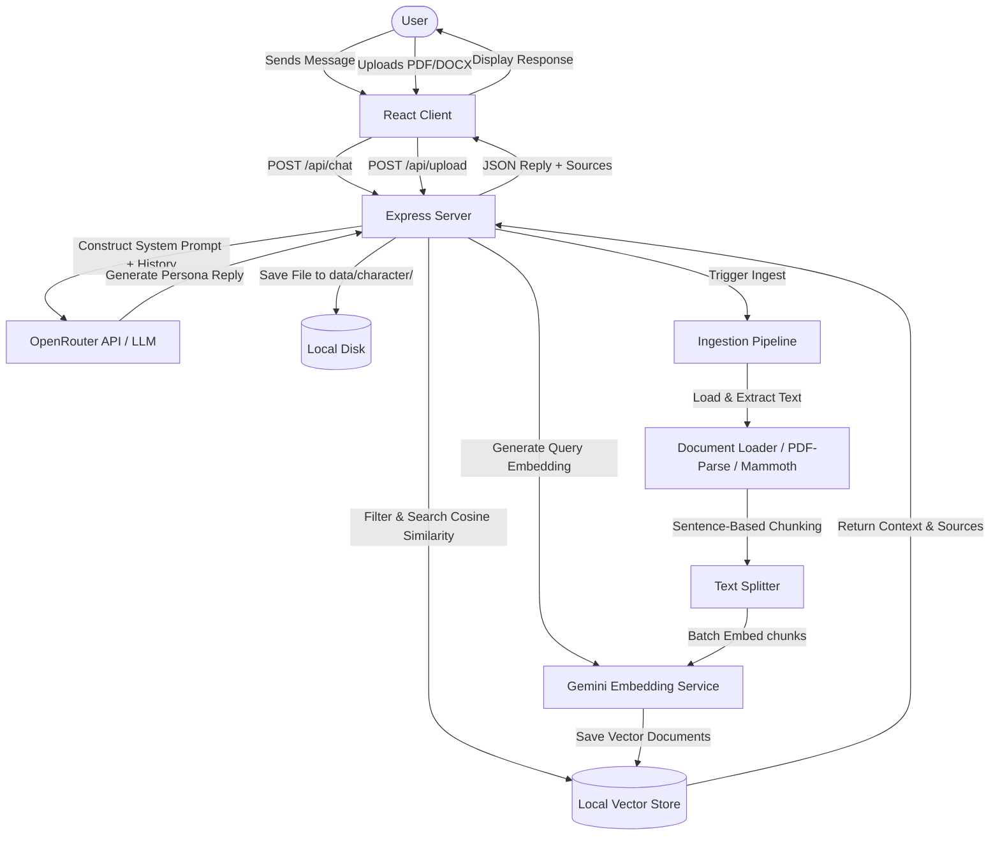
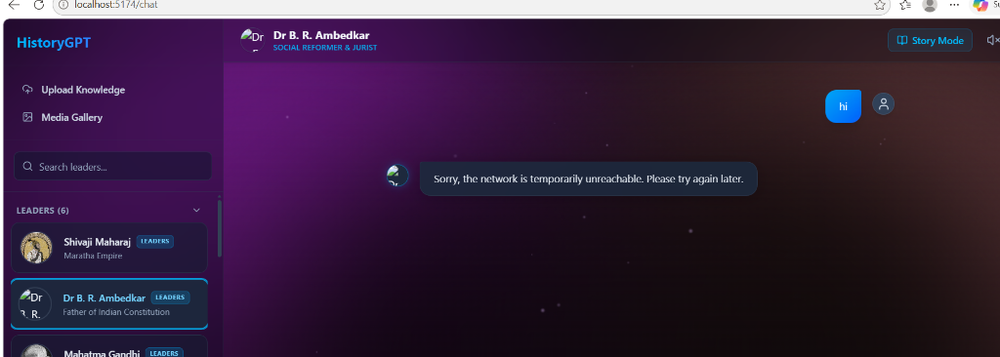

# HistoryGPT – AI History Assistant

Active learning conversational platform enabling real-time context-grounded dialogues with history's legends.

---

<div align="center">


</div>

---

## 📝 Project Overview

**HistoryGPT** is an immersive, full-stack educational web application designed to bring history to life. The application allows users to hold interactive, first-person conversations with historical figures across three categories: Leaders, Scientists, and Innovators. 

Grounding these dialogues in actual historical documents using Retrieval-Augmented Generation (RAG) ensures that the responses are historically accurate and free from typical AI hallucinations. The application is presented in a premium cosmic glassmorphism layout centered around a custom-engineered WebGL 3D glass portal.

---

## ❓ Problem Statement

Traditional history education is fundamentally passive. Students and history enthusiasts learn through textbooks, static timelines, and lecture listening, which often disconnects the learner from the human, decision-making, and emotional realities of historical events. 

Furthermore, existing generic AI assistants (like ChatGPT or Gemini) lack contextual grounding when acting as historical figures, frequently hallucinating dates, fabricating quotes, and mixing modern perspectives with historical figures.

---

## 💡 The Solution

**HistoryGPT** transforms passive learning into active dialogue. By implementing a local RAG (Retrieval-Augmented Generation) pipeline, the application allows users to upload primary sources, diaries, biography documents, and media directly to a historical figure's knowledge base. 

The AI model (Gemini & OpenRouter APIs) dynamically searches this database to ground its responses in verified documents, ensuring historically accurate, roleplay-realistic, and highly educational conversations.

---

## 🚀 Features

* **AI Persona Dialogue**: First-person interactive chat mimicking the exact tone, knowledge, and values of the chosen legend.
* **Auto-Ingestion RAG Pipeline**: Instantly parses, chunks, and embeds uploaded documents (`.pdf`, `.docx`, `.txt`) using Google Gemini Embeddings and indexes them in a local vector database.
* **Inline Attachment Bar**: ChatGPT-style file attach menu next to the message input field allowing dynamic file selection.
* **Drag-and-Drop Ingestion**: Interactive drag-and-drop glowing drop zone overlay for seamless uploads.
* **Media Gallery Grid**: Organizes all uploaded documents, images, audio, and videos in character-specific galleries for previews.
* **Dynamic Chronological Timelines**: Auto-generates and caches summaries of major life events of characters from historical databases.
* **Custom 3D WebGL Shader Portal**: A high-definition, 60 FPS rotating glass centerpiece using custom GPU fragment shaders, including studio light reflections and transparent composite blending.

---

## 🛠 Tech Stack

* **Frontend**: React 19 (TypeScript), Tailwind CSS, Framer Motion, HTML5 Canvas, WebGL, custom GLSL Shaders.
* **Backend**: Node.js, Express (TypeScript), Multer.
* **AI Integration**: Google Gemini API (for Vector Embeddings), OpenRouter API (for completes/chat responses).
* **Database**: Local file-based JSON Vector DB utilizing custom Cosine Similarity matching.
* **Parsing Utilities**: `pdf-parse` (PDF extraction), `mammoth` (Word file parsing).

---

## 📐 System Architecture

The workflow below displays how queries and documents are processed between the client and RAG system:



---

## 📁 Folder Structure

```
historygpt/
├── LICENSE                        # MIT License configuration
├── CONTRIBUTING.md                # Guide for project contributors
├── CODE_OF_CONDUCT.md             # Contributor Covenant Code of Conduct
├── README.md                      # Project documentation and guide
├── client/                        # Frontend React Application
│   ├── src/
│   │   ├── components/            # UI components (WebGL Orb, Sidebar, ChatBox)
│   │   ├── pages/                 # Routing pages (HomePage, ChatPage)
│   │   ├── services/              # Axios API setup
│   │   └── data/                  # Static legends data and timelines
│   ├── package.json
│   └── vite.config.ts
└── server/                        # Backend Node/Express Application
    ├── data/                      # Structured folders for characters' source files
    ├── src/
    │   ├── controllers/           # API handlers (Chat, Timelines, Uploads)
    │   ├── routes/                # Express routes configurations
    │   ├── services/              # External APIs (OpenRouter, Gemini)
    │   ├── utils/                 # Helpers (Character mapping, Prompt builders)
    │   └── rag/                   # RAG Engine
    │       ├── loaders/           # PDF and Word parser loaders
    │       ├── embeddings/        # Vector embedding generator
    │       ├── vectorstore/       # Cosine-similarity database manager
    │       └── ingest.ts          # Bulk ingestion manager
    ├── .env.example               # Safe environment configuration template
    └── package.json
```

---

## 💻 Installation & Local Setup

### Prerequisites
* [Node.js](https://nodejs.org/) (v18 or higher recommended)
* A Google Gemini API Key (for Embeddings)
* An OpenRouter API Key (for LLM Chat completions)

### Step 1: Clone the Repository
```bash
git clone https://github.com/Jeevana4545283/historygpt.git
cd historygpt
```

### Step 2: Configure and Start the Server
1. Navigate to the server folder:
   ```bash
   cd server
   ```
2. Install server dependencies:
   ```bash
   npm install
   ```
3. Copy environment configuration and populate variables:
   ```bash
   cp .env.example .env
   ```
4. Start the server in development mode:
   ```bash
   npm run dev
   ```
   *The backend runs on [http://127.0.0.1:5000](http://127.0.0.1:5000).*

### Step 3: Configure and Start the Client
1. Navigate to the client folder:
   ```bash
   cd ../client
   ```
2. Install client dependencies:
   ```bash
   npm install
   ```
3. Start the client:
   ```bash
   npm run dev
   ```
   *The frontend runs on [http://localhost:5174/](http://localhost:5174/).*

---

## 🔑 Environment Variables

Set up `/server/.env` with the following variables:

```ini
PORT=5000
OPENROUTER_API_KEY=your_openrouter_api_key_here
LLM_MODEL=google/gemma-4-31b-it:free
GEMINI_API_KEY=your_gemini_api_key_here
```

---

## 🔌 API Endpoints

### LLM Connectivity
* **`GET /api/test-llm`**
  - Utility to test OpenRouter completion capabilities.
  - *Response*: `{ success: true, response: "Hello! ..." }`

### Chat Engine
* **`POST /api/chat`**
  - Sends a user message and returns the contextually grounded character completion.
  - *Request Body*:
    ```json
    {
      "character": "Albert Einstein",
      "prompt": "Explain special relativity simply.",
      "history": []
    }
    ```
  - *Response*: `{ success: true, reply: "...", sources: [...] }`

### Character Timeline
* **`GET /api/timeline/:character`**
  - Fetches the cached chronological milestones of the character.
* **`POST /api/timeline/:character/refresh`**
  - Clears timeline cache and regenerates it using the local RAG database.

### File Uploads & Galleries
* **`POST /api/upload`**
  - Uploads media or document files to a specific character's folder. If the file is a document (`.pdf`, `.docx`, `.txt`), it automatically triggers the RAG pipeline.
  - *Form-Data*: `file` (binary), `character` (string)
* **`GET /api/media/:character`**
  - Retrieves lists of all uploaded media documents, images, video, and audio URLs sorted by file type.

---

## 📸 Screenshots



---

## 🔮 Future Improvements

1. **OCR Processing**: Integrate Tesseract.js or Gemini Vision to extract and ingest text from uploaded historical images.
2. **Audio Transcription**: Add Whisper API integration to transcribe voice questions into text dynamically.
3. **Database Migration**: Migrate from local JSON vector files to a production SQLite vector database (e.g. `sqlite-vec`) for better scalability.
4. **Custom Character Creator**: Allow users to customize and upload bios to initialize new historical figures directly.

---

## 🤝 Contributing

Contributions are welcome! Please read our [Contributing Guide](CONTRIBUTING.md) to understand the guidelines on coding standards, pull request processes, and testing structures.

---

## 📄 License

Distributed under the MIT License. See [LICENSE](LICENSE) for more information.
